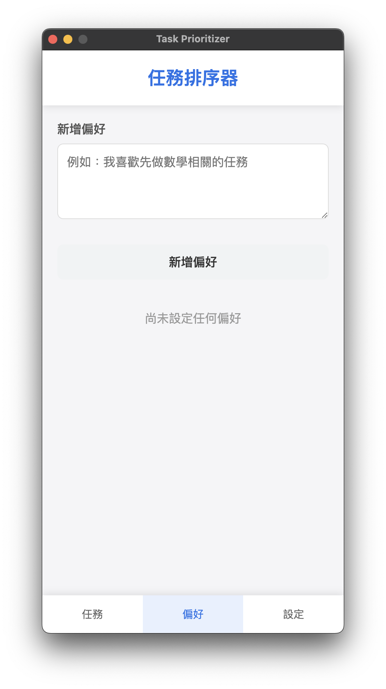

## Task_Prioritizer

### Introduction
**Task_Prioritizer** is a side project designed to automate and intelligently prioritize tasks using a large language model API and the user's Google Calendar Secret Address (iCal Format).

## Features
1. Can be packaged into a desktop application for local use.
2. Users can store their Large Language Model API key and Google Calendar Secret Address (iCal Format).
3. Users can add or remove their task prioritization preferences, which will be considered during the sorting process.
4. Users can select any time range for task prioritization.

## Installation & Running the App
```bash
# Navigate to the project folder
cd project-folder

# Install dependencies
npm install

# Start the application
npm start
```

## Packaging as a Desktop Application
```bash
# Navigate to the project folder
cd project-folder

# Install dependencies
npm install

# Build the desktop app
npm run dist
```

## How to Use
1. Run or open the application. You will see a screen like the one below:

2. Enter your Large Language Model API key and your Google Calendar Secret Address (iCal Format):

3. (Optional) Set up your task prioritization preferences:


4. Select the time range for which you want to prioritize tasks.
5. Run the prioritization process:

